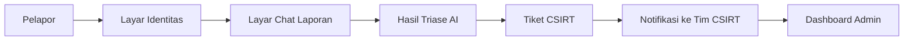

# Low-Fidelity Prototype

Proyek: Sistem Helpdesk Keamanan Siber Multi-Agent Pusdatin Kementan

Dokumen ini berisi sketsa low-fidelity untuk layar utama sistem. Fokusnya adalah alur, struktur informasi, dan hierarki komponen, bukan tampilan visual final.

## 1. Tujuan Prototype

Prototype ini menggambarkan 4 kebutuhan utama sistem:

1. Pelapor mengirim insiden secara cepat dan aman.
2. Sistem melakukan triase otomatis dan memberi mitigasi awal.
3. Tim CSIRT melihat tiket, severity, dan rekomendasi.
4. Admin dapat memantau koleksi RAG dan status penanganan.

## 2. Alur Utama



## 3. Sketsa Layar Utama

### 3.1 Landing / Identitas Pelapor

```text
+--------------------------------------------------------------+
| Logo Sistem          Helpdesk Keamanan Siber                 |
|--------------------------------------------------------------|
| [Panel Informasi]                 | [Form Identitas Pelapor] |
|                                    |                          |
| - Klasifikasi otomatis             | Nama Lengkap            |
| - Panduan mitigasi                 | Unit / Bagian           |
| - Notifikasi CSIRT                 | Email / Kontak          |
| - Aman & teraudit                  | NIP / ID Pegawai        |
|                                    | Jenis Kanal             |
|                                    | [Telegram] [Web]        |
|                                    |                          |
|                                    | [Mulai Laporan]         |
+--------------------------------------------------------------+
```

Fungsi layar ini adalah mengumpulkan identitas dasar sebelum pelapor masuk ke tahap pelaporan insiden.

### 3.2 Layar Chat Laporan Insiden

```text
+--------------------------------------------------------------------------------+
| Sidebar                | Chat Laporan Insiden                                   |
|------------------------|--------------------------------------------------------|
| Profil Pelapor         | [Asisten AI] Halo, ceritakan insiden yang Anda alami   |
| Status Sesi            |                                                        |
| Panduan singkat        | [User] Email phishing masuk dan meminta login palsu    |
| Riwayat laporan        |                                                        |
|                        | [AI] Mohon informasi tambahan: kapan diterima?         |
|                        |                                                        |
|                        | [Input text.......................................] [>] |
|                        | [Lampirkan file] [Kirim]                               |
+--------------------------------------------------------------------------------+
```

Sketsa ini menekankan percakapan multi-turn, upload bukti, dan validasi awal sebelum triase.

### 3.3 Hasil Triase AI / Ringkasan Insiden

```text
+--------------------------------------------------------------------------+
| Ringkasan Insiden                                                       |
|--------------------------------------------------------------------------|
| Ticket ID        : TICKET-2026-0047                                     |
| Jenis Insiden    : Phishing                                             |
| Severity         : Tinggi                                               |
| Confidence       : 92%                                                  |
| Status Tiket     : PENDING_REVIEW                                       |
|--------------------------------------------------------------------------|
| Rekomendasi Awal                                                         |
| 1. Jangan klik tautan                                                   |
| 2. Ganti password akun                                                  |
| 3. Laporkan email ke tim IT                                             |
| 4. Simpan bukti email                                                   |
|--------------------------------------------------------------------------|
| Sitasi Sumber                                                           |
| - NIST SP 800-61                                                       |
| - MITRE ATT&CK                                                         |
|--------------------------------------------------------------------------|
| [Lihat Tiket]   [Kirim ke CSIRT]   [Lapor Lagi]                          |
+--------------------------------------------------------------------------+
```

Layar ini memperlihatkan hasil klasifikasi, mitigasi, sitasi, dan status review manusia.

### 3.4 Dashboard Admin / CSIRT Inbox

```text
+----------------------------------------------------------------------------+
| Dashboard Admin                                                            |
|----------------------------------------------------------------------------|
| [Ringkasan]  Total Tiket: 27 | Baru: 5 | Tinggi: 2 | Kritis: 1            |
|----------------------------------------------------------------------------|
| Daftar Tiket                                                               |
|----------------------------------------------------------------------------|
| ID Tiket        | Insiden    | Severity | Status          | Aksi           |
| TICKET-0047     | Phishing   | Tinggi   | Pending Review  | [Buka]         |
| TICKET-0048     | Malware    | Sedang   | In Progress     | [Buka]         |
| TICKET-0049     | DDoS       | Kritis   | Pending Review  | [Buka]         |
|----------------------------------------------------------------------------|
| Filter: [Severity] [Status] [Tanggal] [Jenis Insiden]                      |
+----------------------------------------------------------------------------+
```

Fokus dashboard adalah triase operasional: mana yang paling prioritas, mana yang sudah dibaca, dan mana yang butuh eskalasi.

### 3.5 Detail Tiket CSIRT

```text
+--------------------------------------------------------------------------+
| Detail Tiket                                                             |
|--------------------------------------------------------------------------|
| Ticket ID     : TICKET-2026-0047                                        |
| Pelapor       : Agry Zharfa                                             |
| Kontak        : @username / email                                        |
| Insiden       : Phishing                                                 |
| Severity      : Tinggi                                                   |
| Status        : Pending Review                                           |
|--------------------------------------------------------------------------|
| Kronologi Singkat                                                        |
| [Isi laporan asli pengguna]                                              |
|                                                                          |
| Rekomendasi AI                                                           |
| - Jangan klik link                                                       |
| - Reset password                                                         |
| - Verifikasi domain login                                                |
|                                                                          |
| Tombol Aksi                                                              |
| [Assign] [Escalate] [Ubah Status] [Tutup Tiket]                          |
+--------------------------------------------------------------------------+
```

### 3.6 Halaman RAG / Basis Pengetahuan

```text
+--------------------------------------------------------------------------+
| Knowledge Base / RAG                                                      |
|--------------------------------------------------------------------------|
| [Upload Dokumen] [Ingest MITRE] [Reindex]                                |
|--------------------------------------------------------------------------|
| Koleksi Dokumen                                                           |
| - NIST SP 800-61 Rev.2                                                   |
| - NIST SP 800-61 Rev.3                                                   |
| - MITRE ATT&CK                                                           |
|--------------------------------------------------------------------------|
| Status Indeks: Ready                                                     |
| Chunk Terbaru: 2.140                                                     |
| Embedding: text-embedding-3-small                                        |
+--------------------------------------------------------------------------+
```

## 4. Wireflow Singkat

```text
Pelapor
  -> Identitas
  -> Chat Laporan
  -> Hasil Triase
  -> Tiket Dibuat
  -> Notifikasi CSIRT
  -> Admin Review
```

## 5. Catatan Desain Low-Fidelity

- Layout dibuat sederhana dengan pembagian panel kiri-kanan agar alur mudah dipahami.
- Komponen utama yang harus tampak adalah identitas pelapor, input insiden, hasil AI, tiket, dan aksi CSIRT.
- Pada prototype ini, prioritasnya adalah fungsi dan urutan proses, bukan warna, ikon, atau ilustrasi detail.
- Prototype cocok dipakai untuk penjelasan skripsi, validasi kebutuhan, atau dasar desain UI final.

## 6. Rekomendasi Halaman yang Paling Penting

Jika ingin hanya 3 layar inti, gunakan:

1. Landing / Identitas Pelapor
2. Chat Laporan Insiden
3. Detail Tiket CSIRT

Tiga layar tersebut sudah mewakili alur utama sistem dari input sampai eskalasi.
